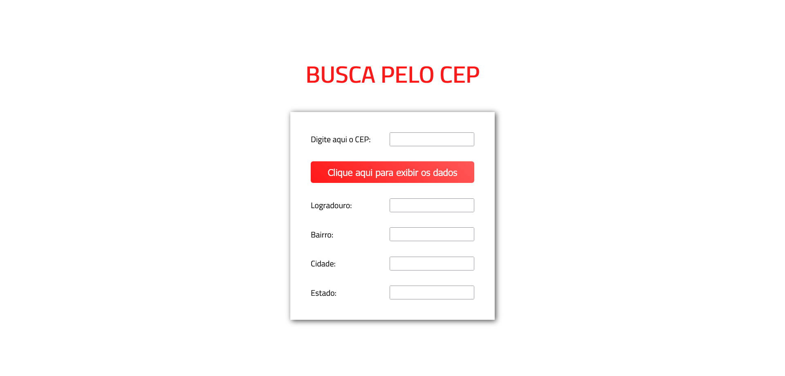

# Página com buscador simples de CEP usando Fetch

## Visão Geral

### Screenshot

### Links

- URL: Working on it.

## Meu processo

### Construído com

- Marcação semântica de HTML
- Propriedades customizadas de CSS
- Flexbox
- JavaScript

### O que aprendi

Neste projeto eu pude utilizar a função "fetch" do JavaScript para obter dados de uma API externa conforme o CEP informado pelo usuário, retornando dados sobre o endereço indicado e os exibindo nos campos, o que é disparado quando o botão é clicado.

## Autor

- GitHub - Vinícius dos Santos Verissimo (https://github.com/viniciusdsv93)
